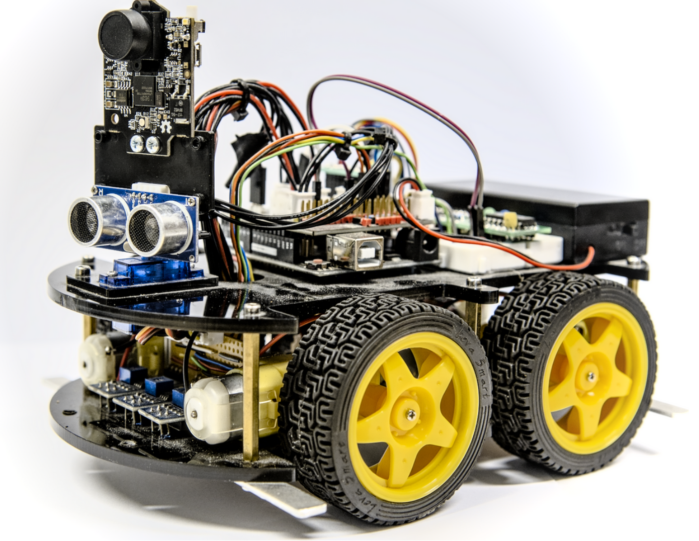

# IESimulIDE

IESimulIDE is a line-follower robot simulator, built on top of the amazing
[SimulIDE](https://simulide.com) electronic circuit simulator.
It is developed at the University of Kassel, Germany, by the Department of Computer Science, Chair of Intelligent Embedded Systems.
The aims to allow students to simulate the actual robots used at the university to ease
experimentation and make learning more accessible. 

It can also be used as a tool for debugging robot firmware by using SimulIDE's feature to slow down the simulation speed
or to make the firmware more reliable by simulating hardware imperfections.

This project is licensed under AGPL-3.0, in accordance with the original SimulIDE license.
Developed and tested on Linux Debian 12.

## Preview


[](https://youtu.be/PN1a-BrEbtA)


[](https://www.youtube.com/watch?v=VIDEO_ID)

## Table of Contents
- [Changes to SimulIDE](#changes-to-simulide)
- [Simulated Hardware](#simulated-hardware)
- [Features](#features)
- [How to build](#how-to-build)
- [Usage](#usage)
- [Frontend Manual](#frontend-manual)

## Changes to SimulIDE
This project is a fork of SimulIDE.
It extends SimulIDE by adding a robot package, which serves
as a model for the physical robot.
The robot package connects via sysv-ipc to the frontend, implemented using
pygame-ce.

## The Hardware simulated
<!--  -->
The robot is custom built around the **Atmega328p microcontroller**.
<p align="center">
  
</p>

A full pin mapping of the robot can be found in the [Pin Mapping PDF](docs/pin_mapping.pdf).

## Features

### Camera Control
Adjust the camera to follow the robot or keep it stationary and 
move it manually. Also allows to zoom in and out for a better view of the simulation.
### Simulation and UI Speed Control
Adjust the simulation speed (via SimulIDE) and the UI refresh rate, 
allowing to observe the system in slow motion.
### Synchronization between Circuit Simulator and frontend.
### Robot Manipulation
Interact directly with the robot by picking it up, moving or rotating it.
### Track Builder
Design custom tracks using a drag and drop editor,
add obstacles or sunspots, and save or load created tracks.
### Simulating hardware imperfections
Simulates real-world hardware limitations by allowing adjustments to motor performance and sensor behavior.
### Ultrasonic simulation
Model ultrasonic distance sensors, including reflections.

## How to build:

### 1. Install Python dependencies:

Make sure you have `Python 3.9.2` or higher installed.

Run
```
pip install -r requirements_python.txt
```

### 2. Install build dependencies
```
apt update && apt -y install make autoconf gcc g++ build-essential libgl1-mesa-dev \
qtbase5-dev-tools qtbase5-dev qttools5-dev-tools qt5-qmake qt5-qmake-bin \
libqt5svg5-dev libqt5serialport5-dev qtscript5-dev qtmultimedia5-dev
```

### 3. Build SimulIDE

To build IESimulIDE you have to choose the build configuration you want to use. The available build configurations are:

#### Release build:
```
cd SimulIDE/build_XX
qmake
make pyinstaller
make -j<# of available cores>
```
#### Debug build:
```
qmake CONFIG+=debug
make pyinstaller
make -j<# of available cores>
```

#### Test build:
```
qmake CONFIG+=test
make pyinstaller
make -j<# of available cores>
```

#### Test Pygame build:
```
qmake CONFIG+=test_pygame
make pyinstaller
make -j<# of available cores>
```

### 4. Run SimulIDE
#### Binary locations: `./SimulIDE/build_XX/executables`
Every build configuration has its own build directory and executable file.


### 5. Run the tests
To run the SimulIDE tests you have to run the `SimulIDE_TEST` executable.

To run the Pygame test and reliability measurments you have to use Make targets instead of the executables.

### Make Targets
After building the project, you can use the following make targets for testing:
#### For Test Pygame build:
- `make unit_test` - Runs the unit tests
- `make behavior_test` - Runs the behavior tests
- `make all_test` - Runs the unit and behavior tests
### For all other builds:
- `make reliability` - Runs the reliablity metrics and failure estimation
The graphs for the failure estimation are saved in the `simulide-1.0.0/reliability` folder. 


### 6. Debugging
The pygame simulation can be started as a script IF simulide is running AND the 
robot circuit is loaded. This can be used to ease debugging:

```
# assuming current working directory is project root
cd pygame
python -m src.main
```

## Usage
- Navigate to the build directory `./SimulIDE/build_XX/executables` and run the binary.
- From the GUI, select `Open Circuit` or press `CTRL + o`.
- Via file picker the robot circuit has to be selected which is located at `./robot_circuits/robot_circuit.sim1`
- To start the frontend right click on the `Robot Package` and in the context menu press `Start Robot Simulator`.
- The simulation can be started and paused by pressing  or space
- For more details, see the [Frontend Manual](#frontend-manual) section.

-----------

## Frontend Manual
Manual for the frontend simualtor GUI.

### Keybinds
- `W` - Camera upwards
- `S` - Camera downwards
- `A` - Camera left
- `D` - Camera right
- `Q` - Camera zoom in
- `E` - Camera zoom out
- `Left Click and Drag` - Drag robot or obstacle
- `Right Click + Mousewheel` - Rotate robot
- `Right Arrow, Left Arrow` - Rotate robot
- `Space` - Start/Stop Simulation

### Buttons:
- `Settings` - Opens Settings Window
- `Reset Position` - Resets robot position and orientation
- `Free Camera` - The camera can be moved freely
- `Robot Camera` - The camera follows the robot
- `Load Track` - Loads a track from a file
- `Enable Builder` - Enables Track Builder mode
- `Red Power Button` - Starts the simulation
- `Yellow Power Button` - Stops the simulation
#### Only available in Track Builder mode is on:
- `Save Track` - Saves the current track to a file
- `Clear Track` - Clears the current track
- `Default Track` - Loads the default track
- `Eraser Off` - Eraser cannot be used
- `Eraser On` - Eraser can be used, click on a track/border line or obstacle to remove it
- `Add Obstacle` - Adds an obstacle to the track
- `Draw Border` - Enables border drawing mode
- `Draw Track` - Enables track drawing mode

### Track Builder Controls:
- `Drag and hold Left Click` - Draws a line
- `Hold Strg while of before drawing` - Snaps mouse to end or start of line
- `Strg + Z` - Undo last line

### Settings:
- `FPS` - Frames per second, applies only to the visuals
- `Battery Voltage` - Changes the robot speed
- `Velocity per Voltage` - Changes the robot speed
- `ENA|ENB Scale Factor` - Changes the motor speed individually
- `Sensor Values` - Changes the min and max sensor values
- `Enable|Disable Ultrasonic` - Enables or disables the ultrasonic sensor calculations. Disable if not required for better performance
- `Enable|Disable Ulatrasonic Rays` - Enables or disables the ultrasonic visualization. Disable if not required for better performance
- `Enable|Disable Sunbeams` - Enables or disables the spots on the track that are more sensitive to the IR-sensors.
- `Enable|Disable Sync to SimulIDE` - Enables or disables the synchronization to SimulIDE. Disable for better performance, at the cost of simulation accuracy.
